# HRM Platform — Full Module Flowcharts

**Scope:** the complete 12-area module taxonomy for the target product (Organization & Core HR through
Multi-Tenant / Enterprise Administration). Each section below is a self-contained flowchart covering every
module and sub-module listed for that area.

**How to read the status line under each heading** — this document mixes what the platform does today with
the full target design, so every section is graded against the actual `HRMS_Backend` codebase:

- ✅ **Implemented** — a real model/service backs this, with persistence and business logic.
- 🧪 **Stubbed** — the route and its guard chain exist and are wired into the module-access system, but the
  handler returns hardcoded mock data with no database model behind it yet.
- 🔲 **Planned** — no code exists for this yet; the flow below is the target design, not a description of
  running code.

Diagrams use Mermaid (`flowchart TD`/`LR`); any Markdown viewer with Mermaid support (GitHub, GitLab, VS
Code with the Mermaid extension, Obsidian) renders them directly.

---

## 1. 🏢 Organization & Core HR

**Build status:** 🚧 Mixed — `Department`, `Designation`, `WorkingHours`, `LeavePolicy`, `AttendancePolicy`
and the versioned `OrganizationPolicy` engine are ✅ implemented and physically isolated per tenant.
Branches, Teams, Grades, Cost Centers, the org chart view, full employee profile sub-records (family,
education, bank info, emergency contacts), document expiry tracking, HR letters, and policy acknowledgement
are 🔲 planned — today's `User` record only carries identity, credentials, and role assignment.

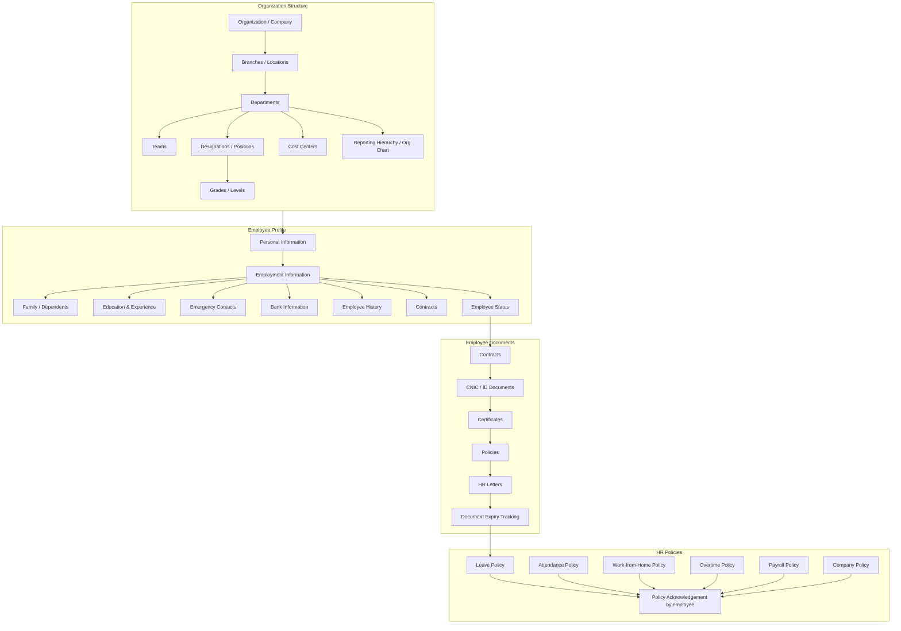

---

## 2. 👥 Recruitment & Talent Acquisition

**Build status:** 🔲 The applicant-tracking pipeline (requisitions, postings, candidates, interviews,
offers) is entirely planned. **Onboarding:** admin invitation → activation → role assignment is
✅ implemented for the first organization admin (`OrganizationAdminInvitationService`); general employee
account creation exists at the service layer (`USER.CREATE_USER`) but isn't yet wired through the API
Gateway, and checklists/asset assignment/orientation/probation tracking are 🔲 planned. **Offboarding:**
`USER.DELETE_USER` exists at the service layer 🚧; notice period, clearance, asset return, final
settlement, and relieving letters are 🔲 planned.

```mermaid
flowchart TD
  subgraph REQ["Manpower Planning"]
    direction LR
    MR["Manpower Request"] --> JR["Job Requisition"]
    JR --> JP["Job Posting"]
    JP --> CP["Careers Page"]
  end

  CP --> CDB

  subgraph ATS["Candidate Pipeline / ATS"]
    direction TB
    CDB["Candidate Database"] --> CV["CV / Resume Management"]
    CV --> PIPE["Candidate Pipeline Stages"]
    PIPE --> INT["Interview Scheduling"]
    INT --> FB["Interview Feedback"]
    FB --> EVAL["Candidate Evaluation"]
  end

  EVAL --> OFFER["Job Offer"]
  OFFER --> OA["Offer Approval"]
  OA --> COMM["Candidate Communication"]
  COMM -->|"accepted"| PB

  subgraph ONB["Onboarding"]
    direction TB
    PB["Pre-boarding"] --> JC["Joining Checklist"]
    JC --> DC["Document Collection"]
    DC --> EAC["Employee Account Creation"]
    EAC --> DA["Department Assignment"]
    DA --> AA["Equipment / Asset Assignment"]
    AA --> ORNT["Orientation"]
    ORNT --> PROB["Probation Tracking"]
  end

  PROB -->|"confirmed"| ACTIVE(["Active Employee"])
  ACTIVE -->|"resigns or terminated"| RES

  subgraph OFF["Offboarding / Separation"]
    direction TB
    RES["Resignation / Termination"] --> NP["Notice Period"]
    NP --> EXIT["Exit Interview"]
    EXIT --> CLR["Clearance"]
    CLR --> AR["Asset Return"]
    AR --> FS["Final Settlement"]
    FS --> REL["Experience / Relieving Letter"]
  end
```

---

## 3. ⏰ Time & Workforce Management

**Build status:** 🚧 Mixed — Leave Policy, Attendance Policy, and Working Hours are ✅ implemented as
tenant-scoped configuration. Actual attendance capture (check-in/out, biometric, mobile, GPS, IP), shift
templates, rotations, roster planning, leave requests with balances/accrual/carry-forward, and overtime
requests/calculation are 🔲 planned. A `penalties` route is 🧪 stubbed under the Attendance module (mock
data only).

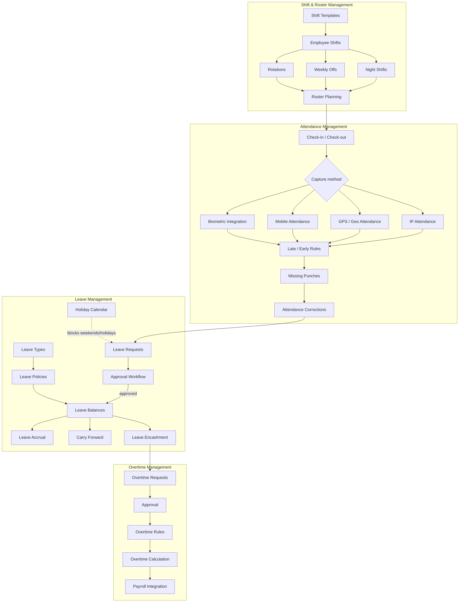

---

## 4. 💰 Payroll & Finance

**Build status:** 🔲 Entirely planned. `PAYROLL` exists only as one of seven `PolicyType` values in the
dynamic organization-policy engine — a policy record, not a calculation engine. `pos/transactions` and
`expenses` routes are 🧪 stubbed (mock data, gated by real guards, no persistence).

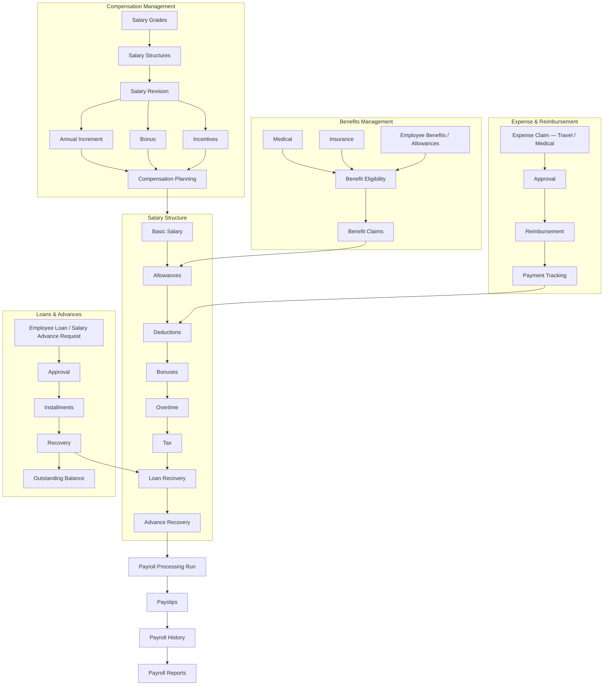

---

## 5. 📈 Performance & Development

**Build status:** 🔲 Entirely planned. `surveys` and `web3/nft-rewards` routes are 🧪 stubbed under the
Performance module (mock data only, no assessment/rating model exists).

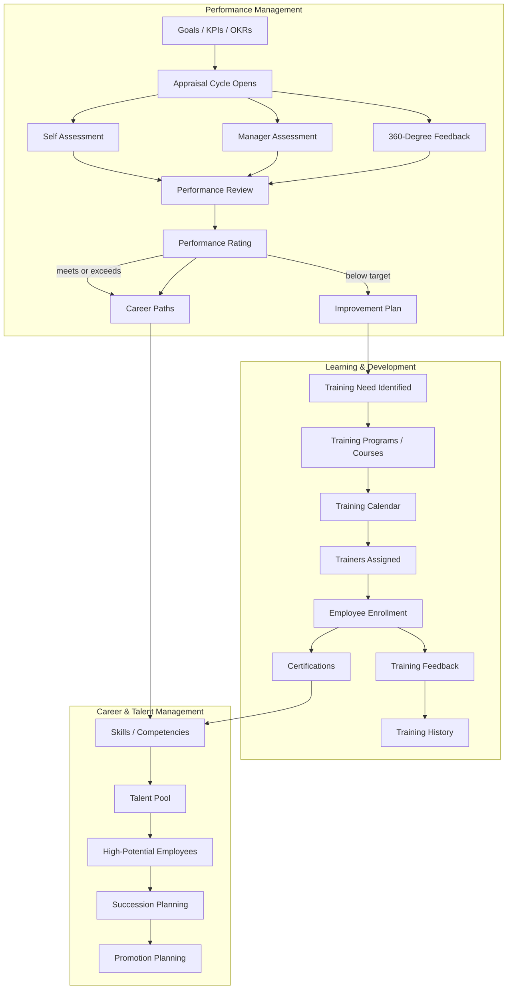

---

## 6. 📋 Work & Productivity

**Build status:** 🔲 Entirely planned — no project, task, or timesheet model exists in the current
codebase.

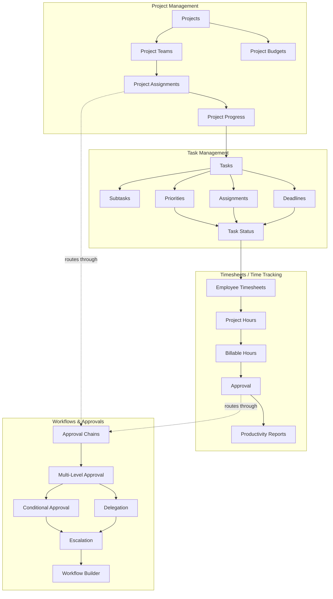

---

## 7. 🧑‍💼 Employee Experience

**Build status:** 🚧 Mixed — profile, avatar, security (password/2FA/sessions/login activity), and
notification-preference self-service are ✅ implemented (`auth-service` profile endpoints). Payslips,
leave, and expense self-service have no backing feature yet. `announcements`, `surveys`, and
`community/posts` are 🧪 stubbed; `tickets` (Helpdesk) is 🧪 stubbed. Manager Self-Service and formal
Grievance case management are 🔲 planned.

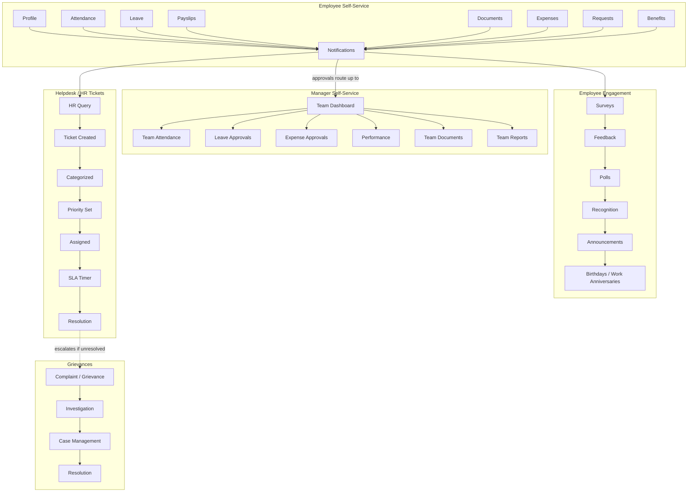

---

## 8. 💻 Assets, Documents & Communication

**Build status:** 🚧 Mixed — generic file upload/download/metadata/delete (S3 or local disk, tenant-scoped
access checks) and transactional email (`MAIL.SEND_EMAIL`/`SEND_TEMPLATE_EMAIL`) are ✅ implemented. An
`assets` route is 🧪 stubbed (mock list, not backed by the real file/asset model). HR letter templates,
SMS/push/internal chat, and document versioning/expiry alerts are 🔲 planned.

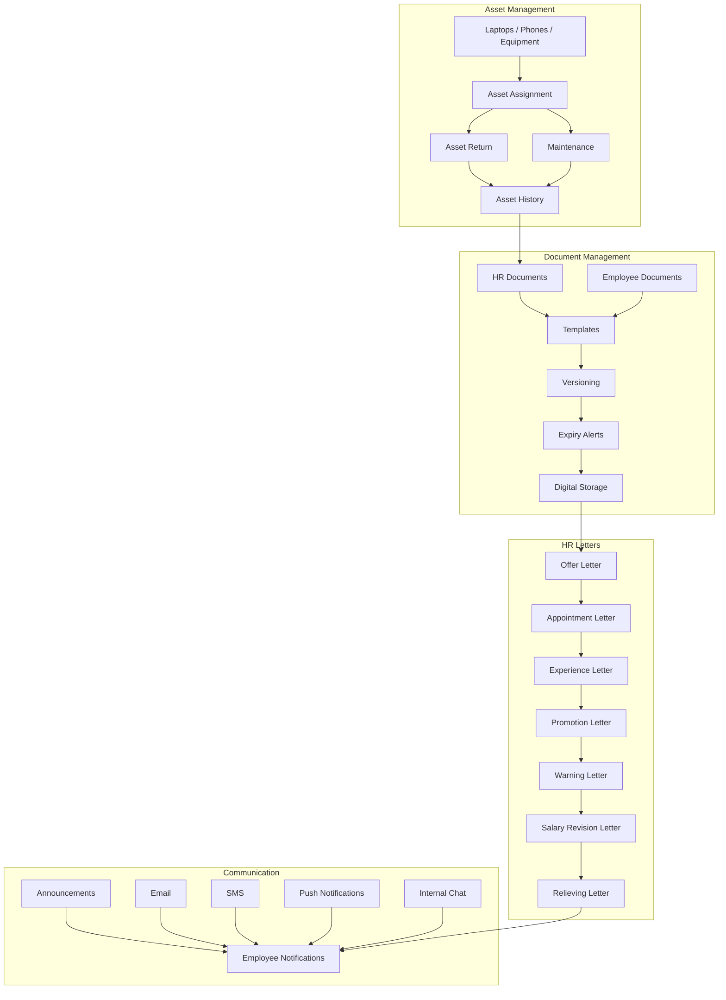

---

## 9. 📊 Reports, Analytics & Intelligence

**Build status:** 🔲 Mostly planned. A real entity-change audit trail (`AUDIT.QUERY_ENTITY_LOGS`) exists
✅ for Users/Roles/Permissions. A `dashboard` route and a separate `audit-logs` route under the Modules
controller are 🧪 stubbed (hardcoded numbers, not the real audit trail). Headcount/attrition/recruitment
reports, analytics, role-scoped dashboards, and the AI assistant are 🔲 planned.

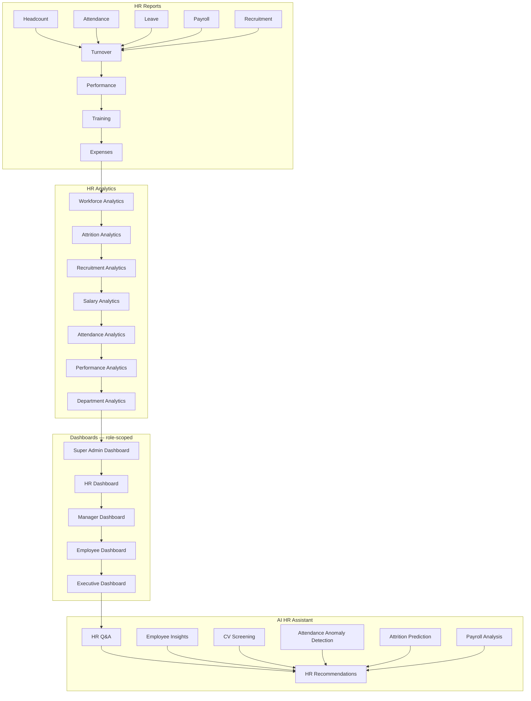

---

## 10. 🔐 Administration, Security & Platform

**Build status:** ✅ Mostly implemented — Roles, Permissions, module/action-level access, Users,
Invitations, Account Activation, 2FA, Sessions, Login History, and Audit Logs are all real and enforced by
the JWT → Tenant → Roles → Permissions → Module guard chain. System Settings (localization, currency, time
zone, custom fields), notification templates, and third-party Integrations (biometric devices, banking,
accounting, SMS, WhatsApp, calendar, webhooks) are 🔲 planned — a signed REST API between the gateway and
microservices already exists as the platform's own internal integration layer.

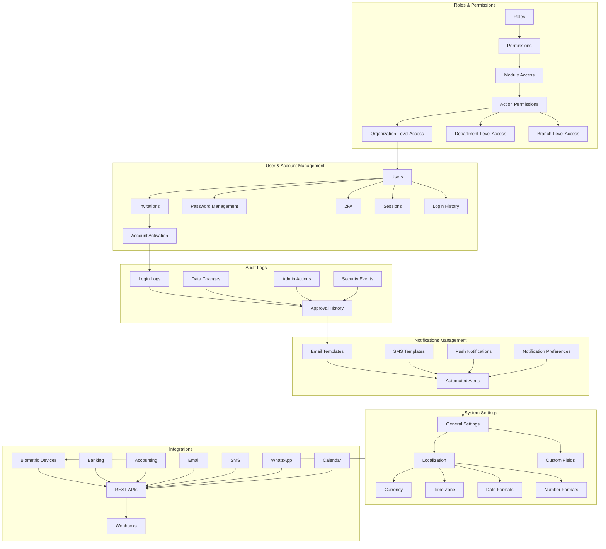

---

## 11. 🌍 Compliance

**Build status:** 🔲 Entirely planned — no statutory-compliance or health-and-safety model exists in the
current codebase.

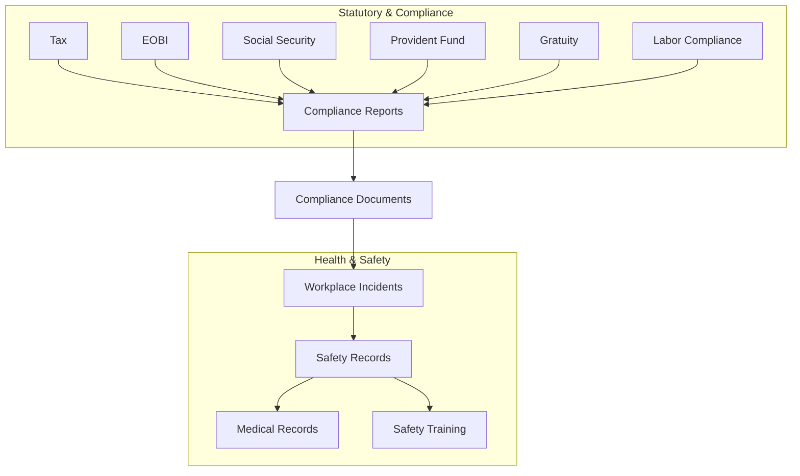

---

## 12. 🏢 Multi-Tenant / Enterprise Administration

**Build status:** ✅ Implemented — this is the most mature area of the platform today. Organization
onboarding, tenant provisioning (one physical database per tenant), organization admins, platform
users/roles, subscriptions/plans/payments/invoices, usage limits, module entitlements, and tenant
configuration (settings, enabled modules, policies, departments, designations) are all real. Platform
monitoring (system health, service monitoring, tenant usage, API usage, error logs) is 🔲 planned beyond a
basic health-check endpoint per service.

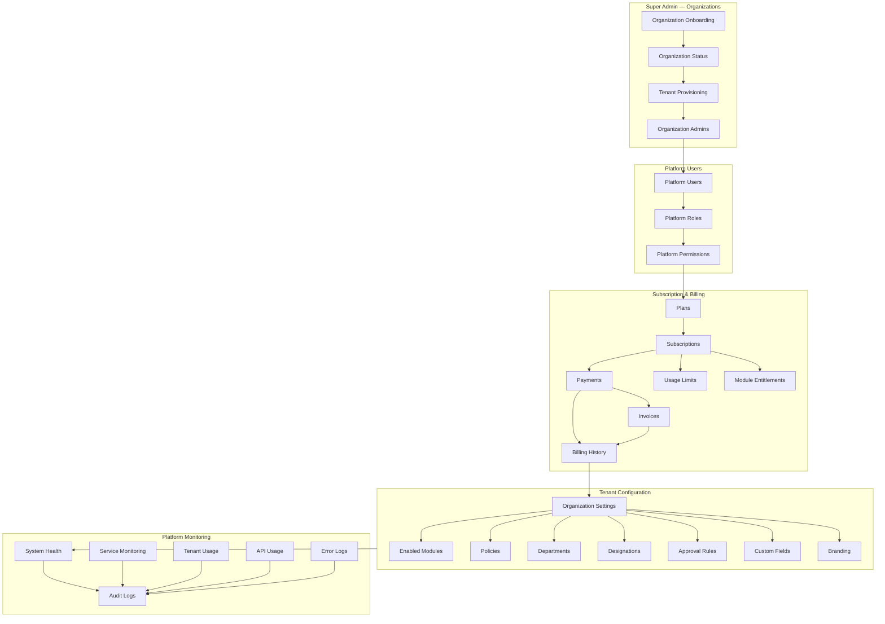

---

## Appendix — mapping to a 12-row product sidebar

If these 12 detailed areas get collapsed into a simpler product sidebar, they map onto a 12-row structure
like this (Learning splits out of Performance & Development; Compliance and Multi-Tenant Administration
fold into a broader Administration row):

| # | Sidebar area | Detailed sections above |
|---|---|---|
| 1 | Core HR | §1 Organization & Core HR |
| 2 | Recruitment | §2 Recruitment (ATS portion) |
| 3 | Onboarding | §2 Recruitment (Onboarding/Offboarding portion) |
| 4 | Time & Attendance | §3 Time & Workforce Management |
| 5 | Payroll & Finance | §4 Payroll & Finance |
| 6 | Performance & Talent | §5 Performance & Development (Performance + Talent) |
| 7 | Learning | §5 Performance & Development (L&D portion) |
| 8 | Work Management | §6 Work & Productivity |
| 9 | Employee Experience | §7 Employee Experience |
| 10 | Assets & Communication | §8 Assets, Documents & Communication |
| 11 | Reports & AI | §9 Reports, Analytics & Intelligence |
| 12 | Administration | §10 Administration, §11 Compliance, §12 Multi-Tenant Administration |
